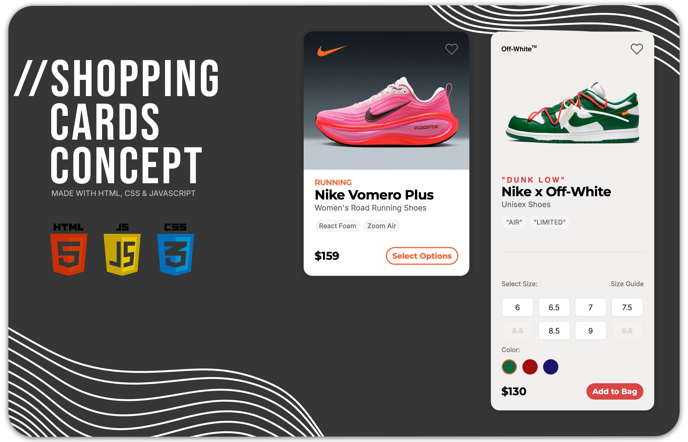
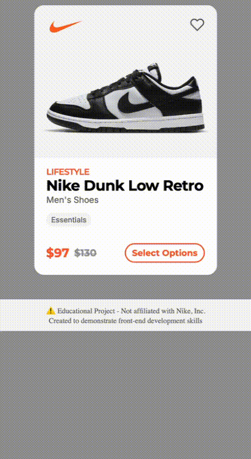

# Nike Shopping Cards - Brand Design System

A responsive e-commerce card system showcasing how Nike adapts its design language across different market segments - from performance running to lifestyle streetwear to luxury collaborations.

### Here’s a quick look at the interactions in action ↓
 

## Project Overview

This project explores how brand identity shapes UI design by creating three distinct Nike product cards, each targeting different audiences while maintaining brand cohesion.

### Live Demo: [View Project](https://claudio-css.netlify.app/projects/brand-card-systems/)

## Built With

- **HTML5**
- **CSS3** - Custom properties, Grid, Flexbox
- **JavaScript** - Dynamic color switching, size selection, expandable cards

## Features

- **Dynamic Color Selection** - Each shoe variant updates with product-specific colorways
- **Size Availability** - Real-time stock status with disabled states
- **Expandable Options** - Product option/styles
- **Responsive Design** - Mobile grid layout approach
- **Interactive Elements** - Hover states, active selections

## Design Variations

### 1. Performance Running
Clean, technical design focusing on product specifications and performance features.

### 2. Lifestyle Streetwear  
Simplified aesthetic emphasizing style over specs.

### 3. Off-White Collaboration
Here’s how I imagined a Nike x Off-White product card might look in a real shop setting.

## Key Learnings

- **CSS Architecture** - Implemented scalable CSS with custom properties and utility classes
- **Design Systems** - Understanding how subtle changes communicate different brand messages
- **Code Organization** - Refactored from 400+ lines to organized, maintainable components

## Future Enhancements

- [ ] Dark mode toggle
- [ ] Cart functionality
- [ ] Additional brand comparisons (Adidas, New Balance)
- [ ] Wishlist system

---

